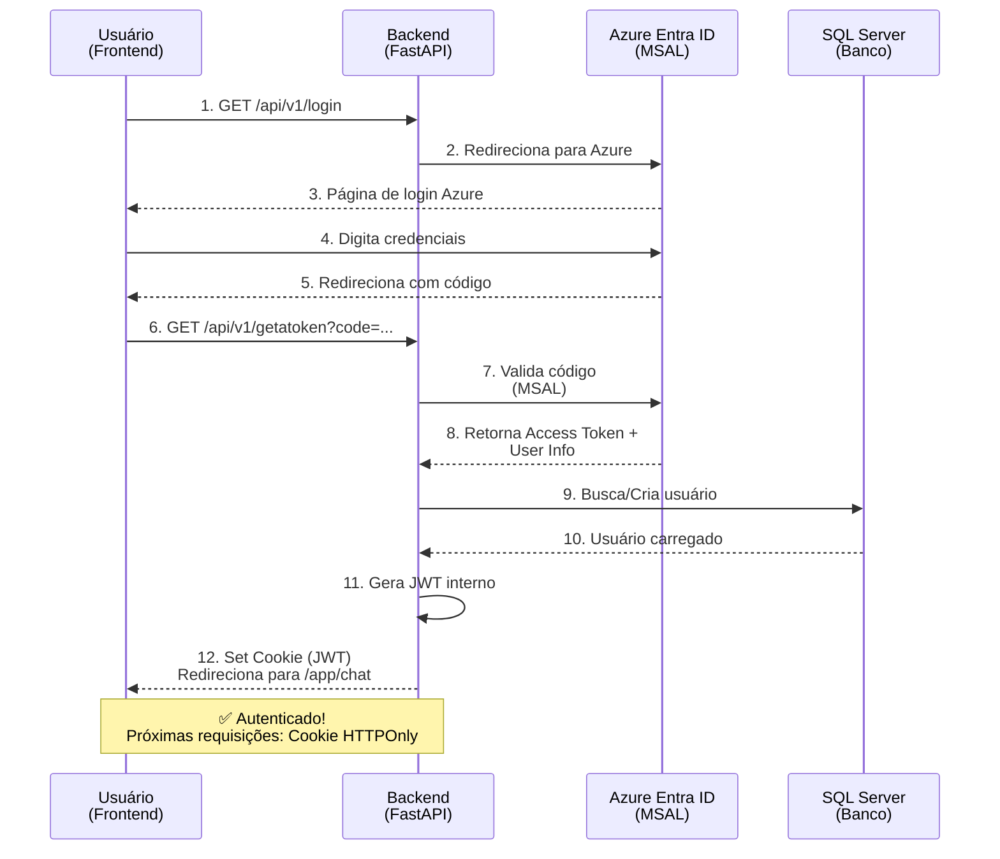
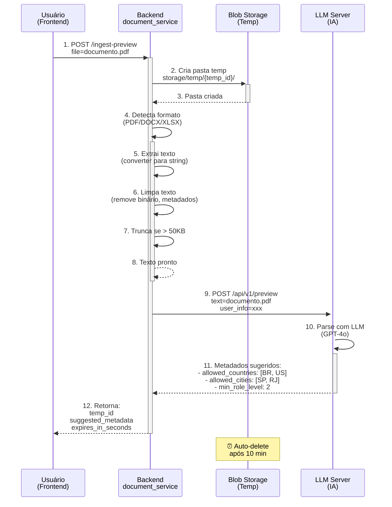
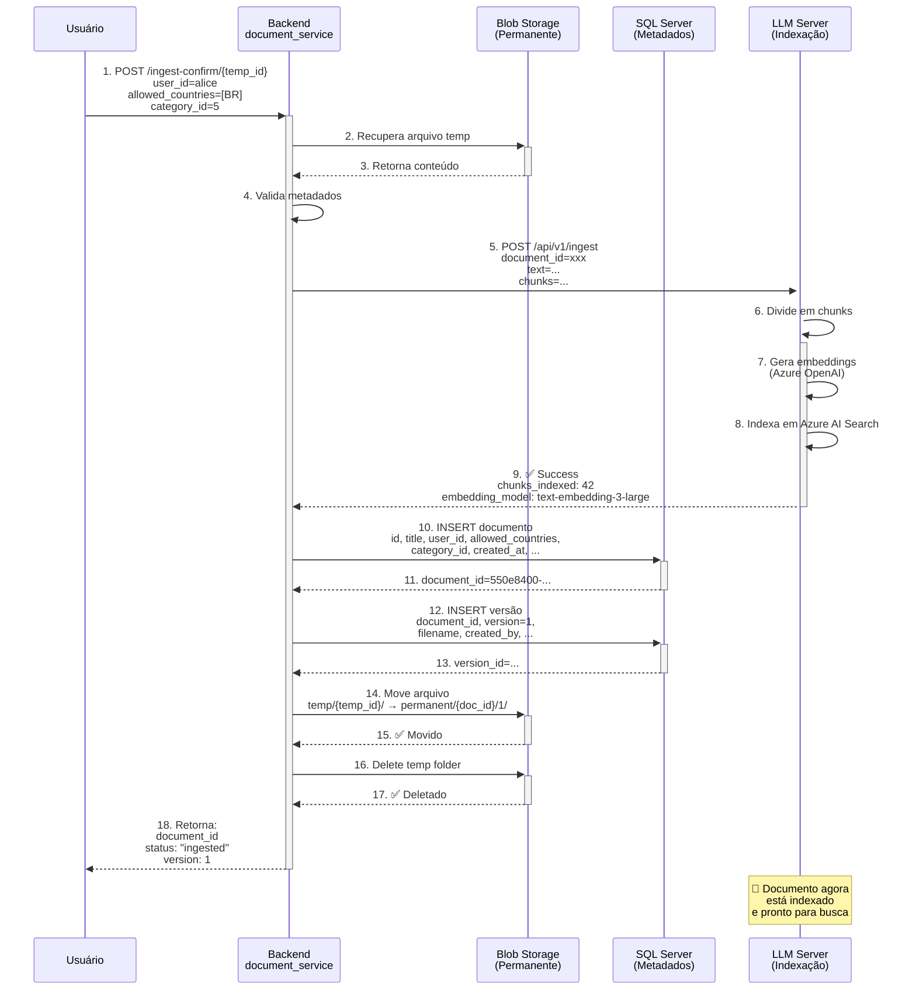
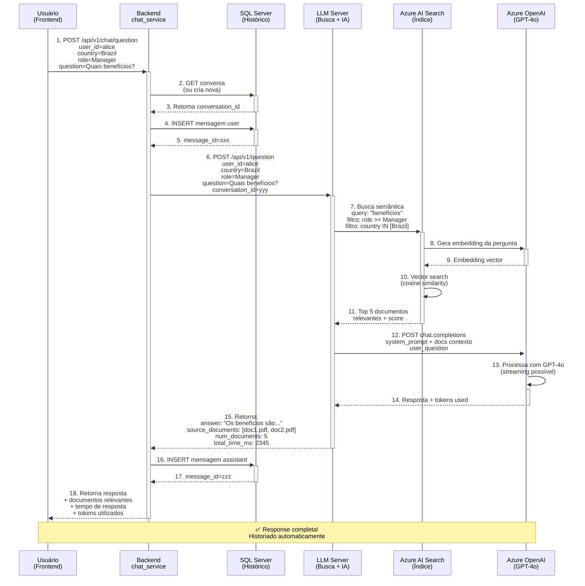
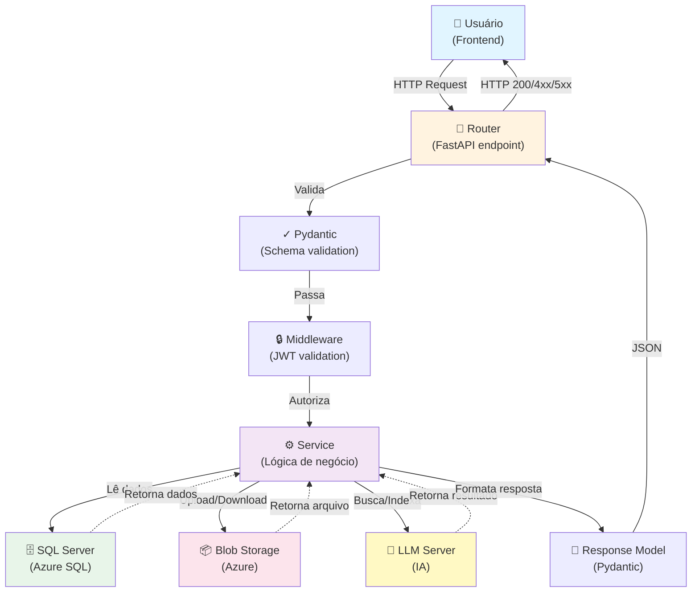
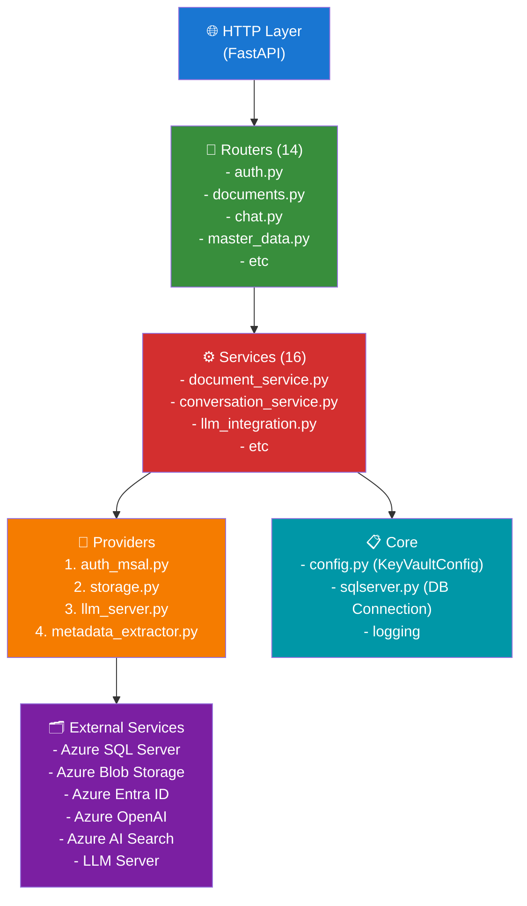
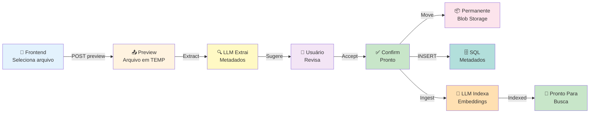
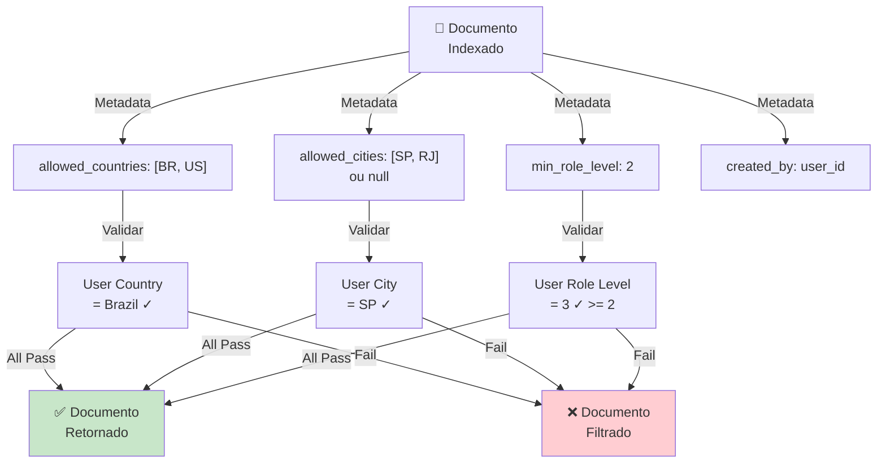
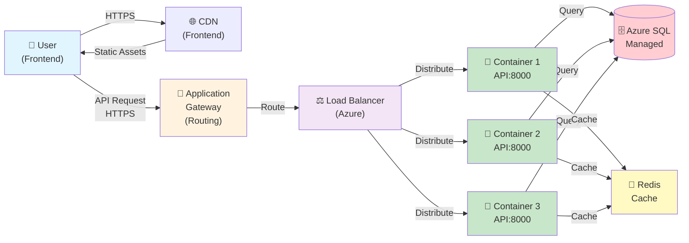

# 📊 Diagramas de Arquitetura - Fluxos Visuais

**Diagramas dos fluxos principais do backend em Mermaid.js**

---

## Índice

1. [Fluxo de Autenticação](#fluxo-de-autenticação)
2. [Fluxo de Ingestão de Documentos](#fluxo-de-ingestão-de-documentos)
3. [Fluxo de Chat com LLM](#fluxo-de-chat-com-llm)
4. [Integrações: Request → Serviços → Resposta](#integrações-request--serviços--resposta)

---

## Fluxo de Autenticação

Quando um usuário faz login pela primeira vez:



**Detalhes**:
- ✅ Token do Azure → Valida identidade
- ✅ JWT interno → Sessão do backend
- ✅ Cookie HTTPOnly → Seguro contra XSS
- ✅ Cada request valida JWT no middleware

---

## Fluxo de Ingestão de Documentos

Vou documentar o fluxo **2-step** (preview → confirm):

### Etapa 1: Preview



**O Que Acontece**:
- ✅ Arquivo salvo temporariamente
- ✅ Texto extraído e limpo
- ✅ LLM sugere metadados
- ✅ Usuário revisa em frontend
- ✅ Arquivo expira em 10 min se não confirmar

---

### Etapa 2: Confirm



**O Que Acontece**:
- ✅ Arquivo recuperado do temp
- ✅ LLM Server indexa + gera embeddings
- ✅ Metadados salvos no SQL Server
- ✅ Arquivo movido para permanent
- ✅ Arquivo temp deletado
- ✅ **Pronto para chat!**

---

## Fluxo de Chat com LLM

Quando usuário faz pergunta:



**Detalhes Importantes**:
- ✅ Busca semântica (não por keyword)
- ✅ Filtros de RBAC (role, país, cidade)
- ✅ Contexto dos documentos incluído
- ✅ Histórico salvo para reference
- ✅ Tempos rastreados

---

## Integrações: Request → Serviços → Resposta

Visão geral de como um request flui pela aplicação:



**Fluxo Resumido**:
```
Request → Router → Validação → Middleware Auth → Service → Providers (DB/Blob/LLM) → Response
```

---

## Arquitetura de 5 Camadas

Visão estática da organização do código:



**Responsabilidades**:
- **Routers**: HTTP → Parse → Call Service
- **Services**: Lógica de negócio → Orquestra providers
- **Providers**: Interface com externos (Azure, LLM)
- **Core**: Config, DB, logging compartilhado

---

## Fluxo de Erro (Error Handling)

O que acontece quando dá erro:

```mermaid
sequenceDiagram
    participant User as Usuário
    participant API as Backend
    participant Provider as Provider<br/>(BD/Storage/LLM)
    
    User->>+API: Request
    API->>+Provider: Operação
    
    alt ✅ Sucesso
        Provider-->>-API: Success
        API-->>-User: 200 + data
    else ❌ Erro Provider
        Provider->>-API: Exception
        API->>API: Catch + Log
        
        alt Erro de Validação
            API-->>User: 400 Bad Request
        else Erro de Auth
            API-->>User: 401 Unauthorized
        else Erro de Negócio
            API-->>User: 422 Unprocessable Entity
        else Erro Servidor
            API-->>User: 500 Internal Server Error
        end
    end
    
    Note over API: 🔍 Sempre logga erro<br/>User ID, request ID, timestamp
```

---

## Ciclo de Vida de um Documento

Desde upload até aparecer em buscas:



---

## Filtros de Segurança (RBAC)

Como os documentos são filtrados em buscas:



---

## Deployment: Request → Container → Produção

Visão de como request chega em produção:



---

## Referências & Termos

### Componentes

| Termo | O Quê |
|-------|--------|
| **Router** | Endpoint HTTP (POST /api/v1/documents) |
| **Service** | Lógica (document_service.py) |
| **Provider** | Interface com externos (storage.py) |
| **Middleware** | Filtro aplicado a TODAS as requisições |
| **Pydantic Model** | Validação de schema JSON |

### Protocolos

| Tipo | Descrição |
|------|-----------|
| **HTTP/HTTPS** | Comunicação Frontend ↔ Backend |
| **Azure MSAL** | Protocolo de autenticação Azure AD |
| **JWT** | Token de sessão |
| **REST** | Estilo de API (GET, POST, PUT, DELETE) |

### Azure Services

| Serviço | Função |
|---------|--------|
| **Azure SQL Server** | Banco de dados relacional |
| **Azure Blob Storage** | Armazenamento de arquivos |
| **Azure Entra ID** | Autenticação corporativa |
| **Azure OpenAI** | Modelos de IA (GPT-4o) |
| **Azure AI Search** | Busca semântica com embeddings |

---

## 🎯 Resumo Visual

```
┌──────────────────────────────────────────────────────────────┐
│                  SECURE DOCUMENT PLATFORM                     │
├──────────────────────────────────────────────────────────────┤
│                                                                │
│  👤 User → [Auth] → JWT → [Router] → [Service] → [Provider] │
│                                            ↓                  │
│                              ┌─────────────────────┬───────┐ │
│                              ↓                     ↓       ↓ │
│                          SQL Server         Blob Storage  LLM│
│                                                                │
│  [Upload] → [Preview - Temp] → [Confirm - Permanent]  [Chat]│
│               ↓                      ↓                   ↓    │
│          LLM Extracts          Insert Metadata      Search DB│
│          Metadatos             Index in LLM         + LLM AI │
│                                                                │
│                     ✅ Seguro ✅ Rápido ✅ Escalável        │
│                                                                │
└──────────────────────────────────────────────────────────────┘
```

---

## 📚 Próximas Leituras

Para entender cada parte:
- [RUN_LOCAL_COMPLETE_GUIDE.md](RUN_LOCAL_COMPLETE_GUIDE.md) - Como rodar
- [CONFIG_KEYS.md](CONFIG_KEYS.md) - Variáveis
- [PROJECT_OVERVIEW.md](PROJECT_OVERVIEW.md) - Arquitetura textual
- [DOCUMENT_INGESTION.md](DOCUMENT_INGESTION.md) - Detalhes de ingestão
- [CHAT_API.md](CHAT_API.md) - API de chat

---

**Última atualização**: 20/03/2026  
**Criado em**: Mermaid.js  
**Visualizador**: GitHub Markdown ou https://mermaid.live
